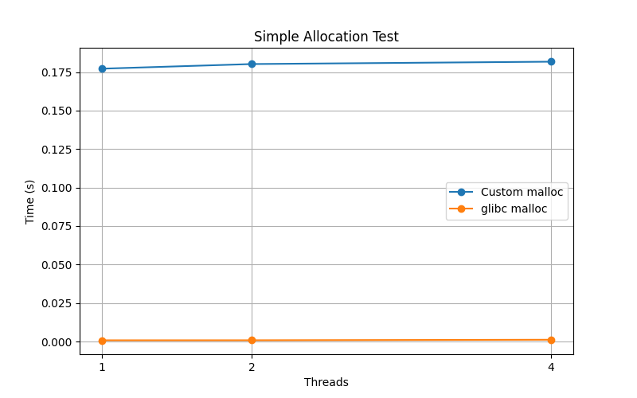
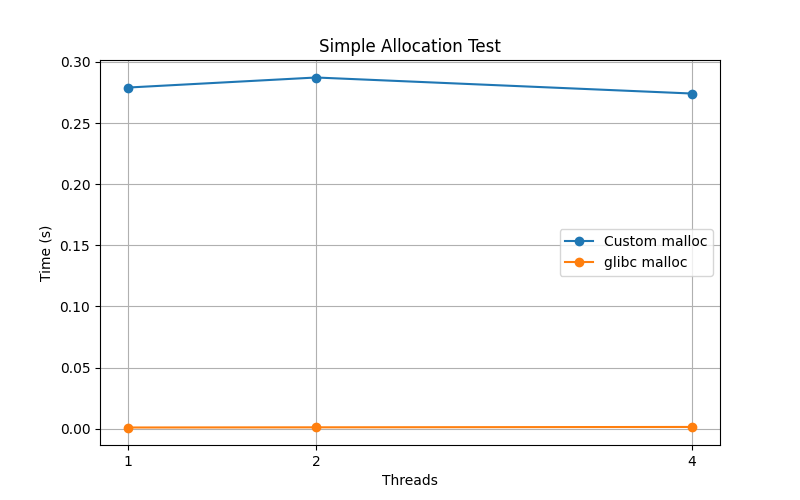

# Memory Allocator Design and Benchmark Evaluation

# 1. Overview

This project implements a custom thread-safe memory allocator that
provides replacements for `malloc()` and `free()`.

The allocator reserves a large region of virtual memory using `mmap()`
and internally manages allocations within this region using a simple
free list allocation policy.

The primary goals of the design are:

- Simplicity
- Reasonable performance
- Thread safety
- Scalability under concurrent workloads

---

# 2. Design Strategy

## 2.1 Memory Management 
- Small and medium allocations: obtained incrementally via `sbrk()` and managed in thread-local arenas.  
- Large allocations: obtained directly via `mmap()`.
> Note: Instead of pre-reserving a single large pool via mmap, this hybrid design grows arenas on demand for small allocations, which saves memory and avoids unused reserved space.


### 2.1.1 Block Structure

Each memory block contains metadata describing the allocation:

* block size
* allocation status
* pointer to next free block

```c
struct Block
{
    size_t size_and_flags;
    Block *prev;
    Block *next;
};
```

- **size_and_flags**: 
    - upper bits = block size (including header)
    - least significant bit (LSB) = free flag (1 = free, 0 = allocated)
- **prev** / **next**: pointers for doubly-linked free list


### 2.1.2 Arena Structure
```c
struct List 
{
    pthread_mutex_t lock;  // protects this arena
    Block *head;           // first block
    Block *end;            // last block
};
```

- **head** → first block in arena
- **end** → last block in arena
- **lock** → used for thread-safe allocation and free


### 2.1.3 Thread-Local arena
```c
__thread List *local_arena = NULL;  // thread-local arena
__thread int local_idx = 0;         // index in global arena list
```

- **local_arena** points to the thread’s arena
- **local_idx** tracks the thread’s index in **arenas[]**


**Benefits**:
- Reduced lock contention
- Better multi-thread scalability
- Memory allocated by a thread is likely reused by the same thread


### 2.1.4 Free List
Free blocks are stored in a linked list (free list). During allocation, the allocator searches this list to find a suitable block.


### 2.1.5 Memory Reservation
At initialization, the allocator reserves a large block of virtual memory using `mmap()`. This memory region is then managed internally by the allocator.

---

## 2.2 Allocation Policy
The allocator uses a first-fit free list policy within each arena.

### 2.2.1 Allocation Steps
1. Acquire **local_arena->lock**
2. Traverse the arena’s block list (**head → end**)
3. Find the first free block with sufficient size
4. If no suitable block exists:
    - Small/medium allocations: request more memory via sbrk() and create a new block in the arena
    - Large allocations: request memory directly via mmap() and bypass the arena
4. If block is larger than requested + header:
    - Split the block into **allocated block + remaining free block**
5. Mark the block as allocated (clear free flag)
6. Release **local_arena->lock**
7. Return pointer to **user memory** (after header)


### 2.2.2 Freeing Memory
When **free(ptr)** is called:
1. Determine the arena owning ptr
2. Acquire the arena lock
3. Mark the block as free (set LSB of size_and_flags)
4. Coalesce with adjacent free blocks if possible
5. Release the arena lock

---

## 2.3 Design choice

| Feature           | Choice                                 | Reasoning                                        |
| ----------------- | -------------------------------------- | ------------------------------------------------ |
| Allocation policy | First-fit                              | Simple to implement, low traversal overhead      |
| Thread safety     | Thread-local arenas                    | Reduces lock contention, improves scalability    |
| Memory pool       | sbrk() for small allocations , mmap() for large allocations         | Efficient small allocation growth; large allocations avoid fragmentation   |
| Block metadata    | Doubly-linked list with size_and_flags | Allows fast splitting/coalescing, compact header |

---

## 2.4 Tradeoffs

| Aspect                  | Pros                                           | Cons                                                               |
| ----------------------- | ---------------------------------------------- | ------------------------------------------------------------------ |
| First-fit               | Fast, simple                                   | May cause external fragmentation over time                         |
| Thread-local arenas     | Scales well with multiple threads              | Extra memory overhead per arena |
| sbrk() for arenas       | Efficient small allocations                    | Fragmentation if free blocks are not coalesced effectively         |
| mmap() for large blocks | Avoids splitting arenas, reduces fragmentation | More expensive system call compared to sbrk()                      |


**Summary**:\
This allocation policy balances **simplicity**, **performance**, and **scalability**. Using thread-local arenas minimizes lock contention while supporting dynamic growth via sbrk() for small allocations and mmap() for large allocations. Some fragmentation and extra arena memory overhead are accepted tradeoffs for scalability and thread safety.

---

## 2.5 Limitation
This allocator is designed for educational purposes and does not include
advanced features found in production allocators such as:
- per-thread caches
- slab allocation
- NUMA awareness
- huge-page optimizations

---

## 2.6 Future Improvements
- Lock-free free lists
- Better fragmentation control
- More advanced allocation strategies (segregated lists, buddy allocator)

---


# 3 Benchmark Results – Custom Allocator vs glibc malloc

This benchmark compares the execution time of the custom memory allocator (thread‑local arenas) with the standard glibc `malloc` implementation on three tests:

- **Simple allocation**
- **Coalesce (allocate/free)**
- **Random allocation**

Each test is run with **1, 2, and 4 threads**. Each thread performs **10,000 allocations** (`OPS_PER_THREAD = 10000`) of fixed size (64 bytes).

---

## Test 1 – Simple Allocation

| Threads | Custom malloc (s) | glibc malloc (s) |
|---------|------------------:|-----------------:|
| 1       | 0.177249          | 0.000794         |
| 2       | 0.180249          | 0.000815         |
| 4       | 0.181784          | 0.001153         |

**Observations:**  
- The custom allocator takes ~0.18 s regardless of thread count, indicating little contention or overhead increase with thread count.  
- glibc `malloc` is orders of magnitude faster for this microbenchmark.

---

## Test 2 – Coalesce Test

| Threads | Custom malloc (s) | glibc malloc (s) |
|---------|------------------:|-----------------:|
| 1       | 0.279015          | 0.000929         |
| 2       | 0.287218          | 0.001071         |
| 4       | 0.274107          | 0.001373         |

**Observations:**  
- Custom allocator times are slightly higher than in the Simple test, likely due to the additional block merging logic.  
- glibc remains extremely fast by comparison.

---

## Benchmark Plots

### Simple Allocation Test


### Coalesce Test


---

## General Interpretation

- The custom allocator shows **reasonably consistent execution time across thread counts**, demonstrating basic scalability with thread‑local arenas.  
- glibc `malloc` is significantly faster on all tests — typical for production allocators that employ complex heuristics and optimizations. 

---

## Discussion

### glibc is much faster than custom

The glibc allocator has been optimized over many years and uses advanced techniques such as:

1. **Thread caching** to reduce contention.
2. **Segregated free lists and binning strategies** for different allocation sizes.
3. **Lazy coalescing and adaptive heuristics** to minimize overhead.

These techniques allow glibc’s allocator to achieve very high throughput compared to simple first‑fit strategies in custom implementation.

### What This Benchmark Shows

- **Execution time** is the most meaningful metric here given the speed differences.  
- When glibc outperforms custom allocation by orders of magnitude on short microbenchmarks, **absolute time is clearer than meaningless “speedup ratios near zero.”**  

---


# References / Literature

1. Silberschatz, Galvin, Gagne. *Operating System Concepts*, 10th Edition, 2018.
2. Tanenbaum, Andrew S. *Modern Operating Systems*, 4th Edition, 2015.
3. Wilson, P. R., et al. "Dynamic Storage Allocation: A Survey and Critical Review." *Proc. of the Intl. Workshop on Memory Management*, 1995.
4. Berger, E. D., McKinley, K. S., et al. "Hoard: A Scalable Memory Allocator for Multithreaded Applications." *ASPLOS VIII*, 2000.
5. GNU C Library Manual: Memory Allocation. [https://www.gnu.org/software/libc/manual/html_node/](https://www.gnu.org/software/libc/manual/html_node/)
6. glibc Malloc Internals. [https://sourceware.org/glibc/wiki/MallocInternals](https://sourceware.org/glibc/wiki/MallocInternals)
7. GNU C Library documentation. [https://www.gnu.org/software/libc/manual/](https://www.gnu.org/software/libc/manual/)